# Modelo de Dados - Sistema Petbem

Este documento descreve a modelagem do banco de dados relacional para o sistema de prontuários, focado na integridade dos dados médicos e no histórico comportamental dos animais.

## 1. Descrição das Entidades
* **Animais:** Registro central do animal resgatado, contendo dados biográficos e status atual.
* **Usuarios:** Cadastro de voluntários e administradores que realizam os atendimentos.
* **Diagnosticos:** Catálogo de doenças e condições identificadas para evitar duplicidade de dados.
* **Tratamentos:** Planejamento médico (remédios e doses) vinculado a um diagnóstico específico.
* **Logs_Evolucao:** O "coração" do prontuário. Registra cada atualização de saúde e comportamento com marcação temporal (timestamp).

## 2. Diagrama de Entidade-Relacionamento (ER)
*Abaixo, a representação visual das tabelas e seus vínculos:*

```mermaid
erDiagram
    ANIMAL ||--o{ LOG_EVOLUCAO : "possui"
    ANIMAL ||--o{ TRATAMENTO : "recebe"
    USUARIO ||--o{ LOG_EVOLUCAO : "registra"
    DIAGNOSTICO ||--o{ TRATAMENTO : "gera"
    
    ANIMAL {
        int id PK
        string nome
        string especie
        date data_ingresso
        string status_adocao
    }
    LOG_EVOLUCAO {
        int id PK
        int animal_id FK
        int usuario_id FK
        datetime data_hora
        string observacao_clinica
        string comportamento_atual
        string status_saude
    }
    TRATAMENTO {
        int id PK
        int animal_id FK
        string medicamento
        string dosagem
        date data_inicio
        date data_fim
    }
```

